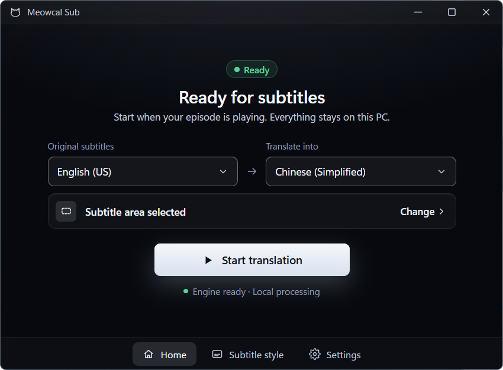
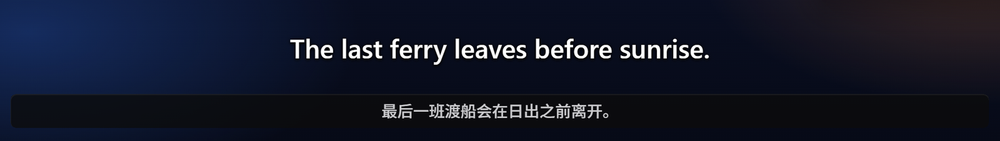

<p align="center">
  
</p>

<h1 align="center">Meowcal Sub</h1>

<p align="center">
  <strong>Translate the subtitles already on your screen.</strong><br>
  Local OCR and AI translation for Windows 11. Your subtitle text stays on your PC.
</p>

<p align="center">
  <a href="https://github.com/PeterShanxin/Meowcal-Sub/releases/latest"></a>
  
  <a href="LICENSE"></a>
</p>

<p align="center">
  <a href="#download"><strong>Download for Windows</strong></a>
  &nbsp;·&nbsp; <a href="#quick-start">Quick start</a>
  &nbsp;·&nbsp; <a href="README.zh-CN.md">简体中文</a>
  &nbsp;·&nbsp; <a href="https://github.com/PeterShanxin/Meowcal-Sub/issues/new/choose">Report a problem</a>
</p>

<p align="center">
  
</p>

Draw a box around the original subtitles in your video. Meowcal Sub reads that
area, translates the text locally, and puts the translation in a floating
overlay. No subtitle file, cloud account, or API key is needed for normal use.

> **Screen text, not speech.** The video needs visible subtitles. Meowcal Sub
> does not listen to audio or generate captions for a video without on-screen text.

## Download

**Windows 11 public beta · v0.8.6** — [release notes and all files](https://github.com/PeterShanxin/Meowcal-Sub/releases/tag/v0.8.6).

| Your PC | Installer |
| --- | --- |
| Intel or AMD Windows PC | **[Download x64 (.exe)](https://github.com/PeterShanxin/Meowcal-Sub/releases/download/v0.8.6/Meowcal.Sub_0.8.6_x64-setup.exe)** |
| Snapdragon or other Windows on ARM PC | **[Download ARM64 (.exe)](https://github.com/PeterShanxin/Meowcal-Sub/releases/download/v0.8.6/Meowcal.Sub_0.8.6_arm64-setup.exe)** |

MSI installers and `SHA256SUMS.txt` are on the release page. For newer versions,
use [the latest application release](https://github.com/PeterShanxin/Meowcal-Sub/releases/latest).
You do not need to install Rust, Node.js, or Meowcal Core separately to use the app.

**Engine requirements:** at least **8 GiB of system RAM reported by Windows**
and **3 GiB free on the engine installation drive**. These are setup checks,
not a guarantee of smooth performance; leave headroom for your video player.

First-time setup downloads the local translation runtime and model, about
**1.1 GB**. Allow additional space for caches and retained versions. Windows may
also need the OCR language for your original subtitles.

**Windows may show an unknown-publisher warning.** Installers are not
Authenticode-signed. Download only from this repository and compare the file's
SHA-256 with the release checksums; do not disable Windows security globally.
[Installation and checksum help →](docs/USAGE.md#installation)

## Quick start

1. **Set up translation.** Open the app and complete the guided setup. Choose
   the original subtitle language and the language you want to read; let setup
   install and test the engine and check the Windows recognition language.
2. **Select subtitle area.** Play the video on your **primary monitor** and
   draw a box around the original subtitles, not the whole video. Keep that area
   visible and reselect it when the video moves or changes size on that monitor.
3. **Start translation.** Watch with the floating translation overlay. Use
   **Subtitle style** for text size and a Dark or Light plate; use
   **Stop translation** when you are done.


[Setup, troubleshooting, and frequently asked questions →](docs/USAGE.md)

## Made for watching

<p align="center">
  
</p>

| What you need | What Meowcal Sub does |
| --- | --- |
| Translate visible subtitles without finding a separate subtitle file | Reads the selected screen region with Windows OCR. |
| Keep captured and translated words off cloud services | Runs OCR and Tencent HY-MT translation on your PC. |
| Read the translation without leaving the video | Shows an always-on-top overlay with adjustable text size and a Dark or Light plate. |
| Translate readable text beyond subtitles | **Translate any text** in Settings relaxes the subtitle-only filter. It is off by default. |
| Keep the local engine working | Guided setup, integrity checks, engine repair, and signature-verified in-app updates. |

**Know the limits.** The normal capture/selection workflow targets the **primary
monitor**, not secondary displays. Recognition depends on the source language,
text clarity, and what screen capture can actually see. Stylized fonts,
fast-changing text, and protected video can cause missing or incorrect results.
Translation is not instant or error-free; speed depends on your PC and the text.

**GPU support differs by architecture.** ARM64 gates Adreno acceleration to
validated hardware/drivers and can retry on CPU after a GPU readiness timeout.
The x64 build uses Vulkan and does **not** currently offer that same validation
gate or application-managed CPU retry. If GPU translation misbehaves on either
architecture, turn on **Settings → Engine and updates → Run the engine on CPU only**.
[GPU compatibility details →](docs/USAGE.md#how-does-gpu-support-differ-by-architecture)

## Privacy, without the fine-print surprise

| Stays on your PC | Uses the network |
| --- | --- |
| Capture of the selected region, Windows OCR, translation inference, and the overlay | Engine/model setup or repair downloads, Windows recognition-language installation when needed, and application update checks/downloads |

In normal mode, **captured and translated subtitle text is not uploaded**.
Production logs record support codes, timings, and counts, not subtitle text.
Once the engine and recognition language are installed, OCR and translation
can run offline; online video playback may still need its own connection.

Update checks run on app startup at most once a day, or when you choose
**Settings → Engine and updates → Check for updates**. An application update is
not downloaded until you start it. Updater signature verification is separate
from Windows publisher signing; it does not remove the installer warning above.

## More Meow tools

Small tools for watching, understanding, and building. Same cats, different jobs.

| Project | Choose it for |
| --- | --- |
| **[Meowcal Sub](https://github.com/PeterShanxin/Meowcal-Sub)** | Direct screen-subtitle capture and local translation — this app. |
| **[Meowcal Sub 2](https://github.com/PeterShanxin/Meowcal-Sub-2)** | Subtitle search and playback-aligned subtitle sessions. |
| **[MeowWatch](https://github.com/PeterShanxin/MeowWatch)** | Watching together with synchronized playback and floating chat. |
| **[Meowcal Core](core/README.md)** | The shared, versioned Windows OCR and local translation runtime for developers; its source lives in this repository. |

Sub 2 is a separate workflow, not a required upgrade for Sub 1. Core is
infrastructure, not another app you need to install manually.

## Under the hood

Tauri 2 and Rust provide the desktop shell. [Meowcal Core](core/README.md) owns
native OCR and the managed HY-MT engine; the app owns capture, subtitle
filtering, translation policy, and presentation. Both Windows x64 and ARM64
installers are published here.

See the [architecture](docs/ARCHITECTURE.md),
[Core design decision](docs/adr/0004-versioned-meowcal-core.md), and
[Core performance evidence](docs/CORE_PERFORMANCE.md). Those measurements describe
specific test conditions, not a universal end-to-end subtitle latency guarantee.

## Help and contribute

[Report a bug or suggest an improvement](https://github.com/PeterShanxin/Meowcal-Sub/issues/new/choose).
Include the app version, Windows build, architecture, and a non-private
reproduction. Do not post captured subtitle text, private screenshots, or raw
logs containing them. Report vulnerabilities privately using [SECURITY.md](SECURITY.md).

For development, start with [CONTRIBUTING.md](CONTRIBUTING.md) and the
[agent guide](docs/AGENT_GUIDE.md). From a prepared Windows checkout:

```powershell
.\scripts\verify.ps1
.\dev-tauri.cmd
```

Browser-only development is available through `.\dev-browser.cmd`; it does not
validate native capture, OCR, overlays, or installers. Intentional contributions
are governed by the [CLA](CLA.md).

## License

Community source: **[AGPL-3.0-only](LICENSE)**. See the
[application notice](LICENSE-NOTICE.md). Using the public project under AGPL does
not require a paid license; commercial licensing is available for organizations
that require different terms.

The downloadable Tencent HY-MT model has its own community license, separate
from the app's AGPL license. [Name and logo use](TRADEMARKS.md) is separate too.
