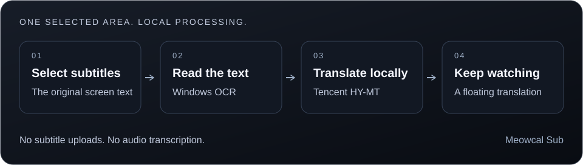

<p align="center">
  
</p>

<h1 align="center">Meowcal Sub</h1>

<p align="center">
  <strong>Capture on-screen subtitles and translate them locally on Windows.</strong>
</p>

<p align="center">
  <a href="https://github.com/PeterShanxin/Meowcal-Sub/releases"></a>
  
  
  
  
  
</p>

<p align="center">
  <a href="https://github.com/PeterShanxin/Meowcal-Sub/releases/latest"><strong>Download</strong></a>
  &nbsp;·&nbsp;
  <a href="https://github.com/PeterShanxin/Meowcal-Sub/releases">All releases</a>
  &nbsp;·&nbsp;
  <a href="https://github.com/PeterShanxin/Meowcal-Sub/releases/tag/v0.6.9">Release notes</a>
</p>

---

## ✨ What it does

Select the on-screen subtitle region once. Meowcal Sub captures that band, runs Windows OCR, translates locally, and draws translated lines in a floating overlay while you watch.

```text
subtitle region → capture → OCR → local translation → overlay
```

No account. Subtitle text is not uploaded. A one-time download (~1.1 GB) sets up the local translation runtime.

## 🎯 Key features

| Feature | Description |
| --- | --- |
| **Screen-region capture** | Select the subtitle band once; the app watches that region while you watch. |
| **Windows OCR** | Uses the built-in Windows OCR engine — no cloud vision API. |
| **On-device translation** | HY-MT runs locally after a one-time model download (~1.1 GB). Subtitle text stays on your machine. |
| **Floating overlay** | Translated lines render in an always-on-top overlay you can position over the video. |
| **ARM64 GPU path** | Validated Adreno configurations can offload inference to the GPU with CPU fallback. |
| **In-app updates** | Check for updates from Settings; downloads are signature-verified before install. |

## ⚡ Engineering

- Tauri 2 desktop shell with Rust backend and a multi-webview frontend (main, selector, overlay, setup wizard).
- End-to-end pipeline: capture → preprocess → OCR → normalize/dedupe → local translation → validate → overlay.
- App-managed engine lifecycle: download, integrity checks, transactional install, rollback, repair.
- Evidence-backed ARM64 acceleration policy with hardware/driver gating and CPU fallback.
- Privacy-safe logging — production logs exclude subtitle text.
- Dual-architecture packaging (x64 + ARM64) published on this repository's GitHub Releases.

## 📊 Performance

On Windows ARM64, local translation reached **~660 ms median latency** in our development evaluation, with a hardware-gated GPU path and automatic CPU fallback.

<details>
<summary>Technical benchmark details</summary>

Measured on specific hardware during development. Figures describe engineering evidence, not marketing guarantees.

### ARM64 translation latency (warm model)

**Environment:** Windows 11 ARM64, HY-MT1.5-1.8B-Q4_K_M, one server slot, fixed warm-up

| Metric | Value |
| --- | --- |
| p50 latency | 660 ms |
| p95 latency | 3,558 ms |

33-case privacy-safe subtitle evaluation; all translated attempts passed the quality grader.

Prior auto-warmup run on same machine: p50 841 ms, p95 4,091 ms.

### ARM64 GPU path (v0.6.9)

**Environment:** Qualcomm Adreno X1-85, driver 31.0.148.0 — gated configuration only

| Metric | Value |
| --- | --- |
| Tail latency | Shorter under sustained load vs CPU-only policy |
| Median latency | Slightly higher than CPU-only |
| GPU startup | A few seconds longer while the model loads |

Tuned for worst-case stalls rather than peak median speed. GPU startup failure falls back to CPU within the same bounded deadline.

</details>

## 🧠 Architecture



| Layer | Role |
| --- | --- |
| Desktop shell | Tauri 2 — window lifecycle, tray, multi-webview UI |
| Capture & OCR | Windows screen capture + WinRT OCR |
| Translation | App-managed local HY-MT runtime with install/repair/rollback |
| Presentation | Selector, setup wizard, and always-on-top overlay webviews |
| Distribution | Dual-arch installers, signature-verified in-app updates |

Module ownership is recorded in [docs/ARCHITECTURE.md](docs/ARCHITECTURE.md).

## 🔒 Privacy

**On your machine:** Screen capture of the selected subtitle region; OCR and translation inference; overlay rendering

**Uses the network for:** One-time download of the translation runtime and model during setup; optional manual update checks (nothing runs until you press the button)

**Never sent:** Captured subtitle text; translated subtitle text

Production logs record support codes, timings, and counts — not captured or translated subtitle text.

## 📦 Installation

| | |
| --- | --- |
| OS | Windows 11 |
| x64 | Intel / AMD Windows PCs |
| ARM64 | Snapdragon and other ARM Windows PCs |
| Disk | ~1.1 GB for the local model (one-time) |

- Installers are not Authenticode-signed; Windows SmartScreen may warn about an unknown publisher.
- Verify downloads with `SHA256SUMS.txt` attached to each release.

Download from [this repository's latest release](https://github.com/PeterShanxin/Meowcal-Sub/releases/latest). The current **v0.6.9** release includes:

| File | Use |
| --- | --- |
| [Meowcal.Sub_0.6.9_x64-setup.exe](https://github.com/PeterShanxin/Meowcal-Sub/releases/download/v0.6.9/Meowcal.Sub_0.6.9_x64-setup.exe) | NSIS installer, Intel / AMD |
| [Meowcal.Sub_0.6.9_arm64-setup.exe](https://github.com/PeterShanxin/Meowcal-Sub/releases/download/v0.6.9/Meowcal.Sub_0.6.9_arm64-setup.exe) | NSIS installer, ARM64 |
| [Meowcal.Sub_0.6.9_x64_en-US.msi](https://github.com/PeterShanxin/Meowcal-Sub/releases/download/v0.6.9/Meowcal.Sub_0.6.9_x64_en-US.msi) | MSI installer, Intel / AMD |
| [Meowcal.Sub_0.6.9_arm64_en-US.msi](https://github.com/PeterShanxin/Meowcal-Sub/releases/download/v0.6.9/Meowcal.Sub_0.6.9_arm64_en-US.msi) | MSI installer, ARM64 |
| [SHA256SUMS.txt](https://github.com/PeterShanxin/Meowcal-Sub/releases/download/v0.6.9/SHA256SUMS.txt) | checksums for the installers |
| [latest.json](https://github.com/PeterShanxin/Meowcal-Sub/releases/download/v0.6.9/latest.json) | release metadata |

Installed copies can update from **Settings → Updates → Check for updates** (manual check only).

## Status

**Windows 11 public beta** — source is this repository.

Current release: **v0.6.9**

## Development

Start with [CONTRIBUTING.md](CONTRIBUTING.md) and
[docs/AGENT_GUIDE.md](docs/AGENT_GUIDE.md). Contributions need a CLA before
merge; see [CLA.md](CLA.md).

From a clean checkout:

```powershell
.\scripts\verify.ps1
```

```powershell
.\dev-tauri.cmd      # architecture-matched Tauri development
.\dev-browser.cmd    # browser-only UI against the Rust HTTP backend
```

Report a problem from the
[issue chooser](https://github.com/PeterShanxin/Meowcal-Sub/issues/new/choose).
See [SECURITY.md](SECURITY.md) to report a vulnerability privately and
[TRADEMARKS.md](TRADEMARKS.md) for name and logo use.

## License

Meowcal Sub community source is licensed under the
[GNU Affero General Public License version 3 only](LICENSE) (`AGPL-3.0-only`).
Commercial licensing is available for organizations that require terms outside
AGPL-3.0.

Using the public project under AGPL does not require a paid license.

The Tencent HY-MT model the app can download is under Tencent's community
license, not AGPL.

See [CLA.md](CLA.md) for the contributor grant,
[TRADEMARKS.md](TRADEMARKS.md) for name and logo use, and
[SECURITY.md](SECURITY.md) to report a vulnerability privately.

---

<p align="center"><sub>Meowcal Sub · v0.6.9 · Windows 11 public beta</sub></p>
