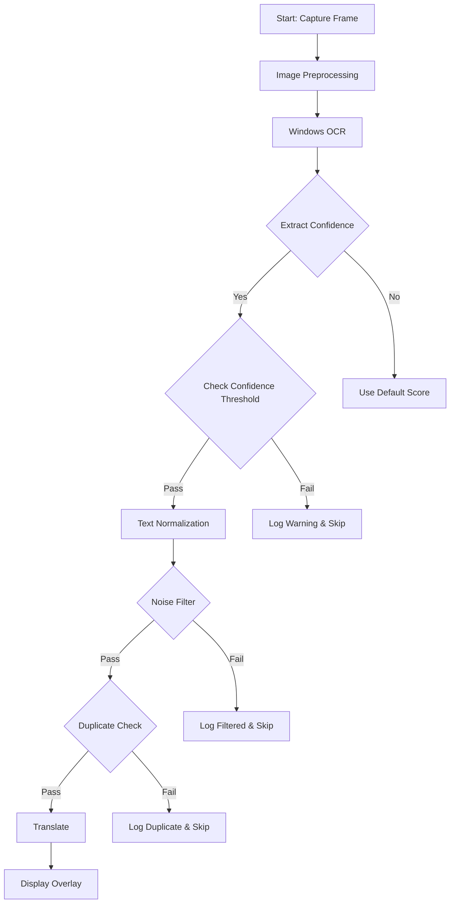

# OCR Noise Improvement Plan

**Date**: 2026-03-01  
**Status**: Draft  
**Reference**: [Translumo Project](https://github.com/ramjke/Translumo)

---

## Executive Summary

This plan outlines improvements to reduce OCR noise in Meowcal-Sub, inspired by Translumo's multi-engine approach. The current implementation uses Windows.Media.Ocr without confidence scoring or image preprocessing.

---

## Current State Analysis

### What's Working
- ✅ Windows.Media.Ocr (WinRT) - same engine as Windows Live Captions
- ✅ Copilot+ PCs NPU acceleration support
- ✅ Basic filtering: empty text, noise (<2 chars), duplicates
- ✅ Text normalization (whitespace collapse, OCR-spaced CJK)

### What's Missing
- ❌ OCR confidence scores NOT used (`OcrResult.confidence` always `None`)
- ❌ No image preprocessing (contrast, binarization)
- ❌ No multi-engine voting/scoring
- ❌ No ML-based result validation
- ❌ Insufficient logging for debugging OCR quality

---

## Proposed Improvements

### Phase 1: Verbose Logging (Immediate)

**Goal**: Capture OCR results in logs to diagnose noise issues

**Changes**:
1. Add DEBUG logging for OCR text output in [`src-tauri/src/commands.rs`](src-tauri/src/commands.rs:1971)
2. Log OCR confidence scores (once implemented)
3. Log filtered reason when text is rejected

**Files to modify**:
- `src-tauri/src/commands.rs` - Add OCR result logging

### Phase 2: Confidence Score Integration

**Goal**: Filter low-quality OCR results using confidence scores

**Changes**:
1. Extract confidence from Windows.Media.Ocr result
2. Add configurable confidence threshold (default: 0.5)
3. Skip translation when confidence is below threshold

**Files to modify**:
- `src-tauri/src/ocr/windows_ocr.rs` - Extract confidence from OCR result
- `src-tauri/src/ocr/mod.rs` - Add confidence field usage
- `src-tauri/src/commands.rs` - Add confidence threshold check
- `src-tauri/src/config.rs` - Add configuration option

### Phase 3: Image Preprocessing

**Goal**: Improve OCR quality through preprocessing

**Preprocessing steps**:
1. Grayscale conversion
2. Contrast enhancement
3. Optional binarization (threshold-based)
4. Deskew (if needed)

**Implementation approach**:
- Use `image` crate for processing
- Apply before passing to Windows OCR
- Make preprocessing optional via config

**Files to modify**:
- `src-tauri/Cargo.toml` - Add `image` dependency
- `src-tauri/src/ocr/windows_ocr.rs` - Add preprocessing pipeline
- `src-tauri/src/config.rs` - Add preprocessing options

### Phase 4: Multi-Engine Voting (Future)

**Goal**: Improve accuracy through ensemble voting (like Translumo)

**Approach**:
1. Add Tesseract as secondary OCR engine
2. Run multiple engines on same image
3. Use ML model or rules to select best result

**Note**: This is a larger undertaking - requires significant implementation effort

---

## Mermaid: Implementation Workflow



---

## Configuration Options

Add to config:

```json
{
  "ocr": {
    "confidence_threshold": 0.5,
    "enable_preprocessing": true,
    "preprocessing": {
      "grayscale": true,
      "contrast_enhance": true,
      "binarize": false
    }
  }
}
```

---

## Files Reference

| File | Changes |
|------|---------|
| `src-tauri/src/ocr/windows_ocr.rs` | Confidence extraction, preprocessing |
| `src-tauri/src/ocr/mod.rs` | Confidence field support |
| `src-tauri/src/commands.rs` | Logging, threshold check |
| `src-tauri/src/config.rs` | New config options |
| `src-tauri/Cargo.toml` | Add image crate |

---

## Testing Plan

1. **Unit tests**: Test confidence extraction, preprocessing functions
2. **Integration tests**: Test OCR pipeline with various images
3. **Manual testing**: Verify logging output with real subtitles

---

## Success Criteria

- [ ] OCR results logged with text and confidence
- [ ] Low-confidence results filtered out
- [ ] Image preprocessing improves accuracy on test images
- [ ] No regression in existing functionality
