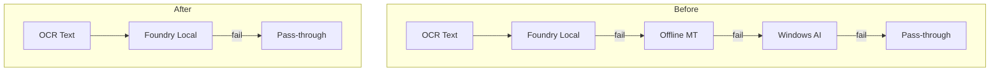

# Plan: Simplify UI Backend Settings - Remove Offline MT and Windows AI

## Objective
Simplify the translation backend settings by removing Offline MT and Windows AI options from both the UI and the fallback chain. Keep only Foundry Local as the primary translation backend with Pass-through as the fallback.

## Current State
The translation fallback chain is:
```
Foundry Local → Offline MT → Windows AI → Pass-through (Mock)
```

## Target State
The translation fallback chain will be:
```
Foundry Local → Pass-through (Mock)
```

---

## Detailed Step-by-Step Implementation Plan

### Phase 1: Rust Backend Changes

#### 1.1 Update `src-tauri/src/config.rs`
- **Lines 112-116**: Remove `enable_windows_ai` and `enable_offline_mt` fields from `TranslationConfig`
- **Lines 165-167**: Remove `offline_mt: OfflineMtConfig` field from `TranslationConfig`
- **Lines 370-379**: Remove `OfflineMtConfig` struct entirely
- **Lines 318-348**: In `normalize()` method:
  - Remove `self.offline_mt.timeout_ms` clamping (line 342)
  - Remove references to `enable_windows_ai` and `enable_offline_mt`
- **Lines 550-570**: In `TranslationConfig::default()`:
  - Remove `enable_windows_ai: cfg!(target_os = "windows")` (line 555)
  - Remove `enable_offline_mt: true` (line 556)
  - Remove `offline_mt: OfflineMtConfig::default()` (line 568)
- **Lines 681-683**: Update tests to remove `enable_offline_mt` assertions

#### 1.2 Update `src-tauri/src/llm/mod.rs`
- **Lines 14-15**: Remove `mod offline_mt;` and `mod phi_silica;` module declarations
- **Lines 23-24**: Remove `pub use offline_mt::*;` and `pub use phi_silica::*;` exports
- **Lines 60-65**: In `BackendId` enum:
  - Remove `WindowsAi` variant
  - Remove `OfflineMt` variant
- **Lines 69-76**: In `as_str()` method:
  - Remove `BackendId::WindowsAi => "windows_ai"`
  - Remove `BackendId::OfflineMt => "offline_mt"`
- **Lines 78-94**: In `from_str()` method:
  - Remove all "windows_ai" | "windowsai" | "windows-ai" | "phi" | "phi_silica" mappings
  - Remove all "offline_mt" | "offlinemt" | "offline-mt" | "translatelocally" mappings
- **Lines 209-221**: Remove `WindowsAiDiagnostics` struct entirely
- **Note**: Keep `mod offline_mt;` and `mod phi_silica;` as they may be used elsewhere or for future use - instead just remove from fallback chain

#### 1.3 Update `src-tauri/src/llm/manager.rs`
- **Lines 7-11**: In imports:
  - Remove `OfflineMtBackend` import
  - Remove `PhiSilica` import
- **Lines 104-113**: In `TranslationManager::new()`:
  - Remove `Box::new(OfflineMtBackend::new(...))` from backends vector
  - Remove `Box::new(PhiSilica::new())` from backends vector
  - Keep only `FoundryLocalBackend` and `MockBackend`
- **Lines 603-606**: In `is_enabled()` method:
  - Remove `BackendId::WindowsAi => self.config.enable_windows_ai`
  - Remove `BackendId::OfflineMt => self.config.enable_offline_mt`
- **Lines 614-617**: In `ordered_backend_ids()` method:
  - Remove `BackendId::OfflineMt`
  - Remove `BackendId::WindowsAi`
  - Keep only `FoundryLocal` and `Mock`
- **Lines 623-625**: In `timeout_ms_for_backend()`:
  - Remove `BackendId::OfflineMt => self.config.offline_mt.timeout_ms as u64`
- **Lines 1179-1194**: In test helper `test_translation_manager()`:
  - Remove `enable_windows_ai: true` and `enable_offline_mt: true`
  - Remove `offline_mt: OfflineMtConfig::default()`
  - Remove `TestBackend` for `BackendId::WindowsAi` and `BackendId::OfflineMt`
- **Lines 1224, 1256**: Update test assertions to remove OfflineMt references

#### 1.4 Update `src-tauri/src/http_server.rs`
- **Lines 237-257**: Remove the entire "Offline MT" backend section (lines 237-248)
- **Lines 250-261**: Remove the entire "Windows AI / Phi Silica" backend section (lines 250-261)
- **Lines 603-605**: Remove `get_windows_ai_diagnostics` endpoint handler
- **Lines 609-627**: Remove `detect_offline_mt_binary` endpoint handler
- **Lines 754-758**: Remove route registrations for:
  - `/api/windows-ai/diagnostics`
  - `/api/offline-mt/detect`

#### 1.5 Update `src-tauri/src/commands.rs`
- **Lines 441-466**: Remove `detect_offline_mt_binary` command function
- **Lines 469-479**: Remove `get_windows_ai_diagnostics` command function

#### 1.6 Update `src-tauri/src/main.rs`
- **Line 262**: Remove `commands::get_windows_ai_diagnostics` import
- **Line 263**: Remove `commands::detect_offline_mt_binary` import

---

### Phase 2: Frontend UI Changes

#### 2.1 Update `src/index.html`
- **Lines 363-388**: Remove entire "Offline MT" card section
- **Lines 391-407**: Remove entire "Windows AI" card section
- **Lines 586-591**: Remove "Windows AI Diagnostics" modal section

#### 2.2 Update `src/scripts/main.js`
- **Line 334**: Remove `config.enableWindowsAi` assignment
- **Line 335**: Remove `config.enableOfflineMt` assignment
- **Line 345**: Remove `offlineMtPath` assignment
- **Lines 666-668**: Remove `enableWindowsAi`, `enableOfflineMt` assignments
- **Lines 997-1000**: Remove Windows AI toggle event listener
- **Lines 1001-1002**: Remove Offline MT toggle event listener
- **Lines 1009-1010**: Remove offline-mt-path change listener
- **Lines 1015-1016**: Remove btn-download-offline-mt click listener
- **Lines 1018-1020**: Remove btn-windows-ai-diagnostics click listener
- **Lines 1722-1725**: Remove windowsAi and offlineMt cases in normalizeBackendId
- **Lines 1894-1918**: Remove `updateOfflineMtStatusInline` function
- **Lines 1922-1956**: Remove `updateWindowsAiStatusInline` function
- **Lines 1974-1991**: Remove `autoDetectOfflineMtPath` function
- **Lines 1994-2021**: Remove `handleWindowsAiDiagnostics` function
- **Lines 2099-2100**: Remove offline input visibility handling in showSettingsTab
- **Lines 2255-2310**: Remove `renderWindowsAiDiagnostics` function

#### 2.3 Update `src/scripts/overlay.js`
- **Lines 875-876**: Remove `case 'offline_mt': return 'Offline MT';`
- **Line 876**: Remove `case 'windows_ai': return 'Windows AI';`

#### 2.4 Update `src/scripts/tauri-bridge.js`
- **Lines 62-66**: Remove `get_windows_ai_diagnostics` API endpoint
- **Lines 65-66**: Remove `detect_offline_mt_binary` API endpoint
- **Lines 146-154**: Remove special handling for `detect_offline_mt_binary` response normalization

---

### Phase 3: Verification

1. Run `cargo build` to verify Rust code compiles
2. Run `cargo test` to verify tests pass
3. Verify the UI renders correctly without the removed cards
4. Verify translation still works with Foundry Local → Pass-through fallback

---

### Summary of Key Changes

| File | Changes |
|------|---------|
| `config.rs` | Remove enable flags and OfflineMtConfig struct |
| `llm/mod.rs` | Remove BackendId variants and WindowsAiDiagnostics |
| `llm/manager.rs` | Simplify fallback chain to Foundry Local → Mock |
| `http_server.rs` | Remove backend info and API endpoints |
| `commands.rs` | Remove Tauri commands |
| `main.rs` | Remove command imports |
| `index.html` | Remove UI cards |
| `main.js` | Remove handlers and functions |
| `overlay.js` | Remove backend labels |
| `tauri-bridge.js` | Remove API endpoints |

---

### Architecture Diagram


