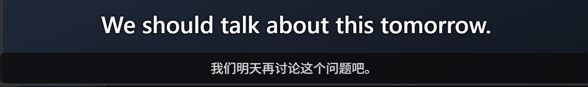

# Subtitle band gate validation — 2026-09-12

The content-aware gate was exercised through the native Windows capture, OCR,
local translation, and overlay pipeline. Inputs were the existing eight-cue
reproduction page and the [offline moving-scene fixture](../../evals/band-gate/README.md).

## Environment

- Windows 11 ARM64, build 26200; display scale 125%.
- English OCR to Simplified Chinese, 250ms capture interval, subtitle-only mode.
- HY-MT1.5-1.8B Q4_K_M with the local GPU engine.
- Isolated development profile; installed application instances were preserved.
- Tested executable SHA-256:
  `7E83818665D5D225AA2ED7AF8EF6E9B9BE9C89C2EC6CB00CDEDC52E2C0820C90`.

## Native results

| Input | Duration | Result |
| --- | --- | --- |
| Existing reproduction page | Two eight-cue cycles, 64 seconds | 16/16 source cues produced true translated events |
| Equal-width moving scene, 1x | 120 seconds | 30/30 correctly recognized, admitted, and translated |
| Negative-band recovery, 1x | 120 seconds | 0 admissions across 325 post-warmup negative frames; all 5 recovery cues translated |

Equal-width gate delay, measured from the first correct OCR observation to
admission, was p50 256.5ms and p95 266.55ms. These are gate delays, not total
translation latency. Negative coverage comprised 129 watermark, 131 timer,
and 65 credits frames. Warmup starts at the first non-empty OCR observation:
six seconds for watermark/timer and three seconds for credits.

Both fixture reports passed their gate and end-to-end checks without partial
coverage. Translation evidence required matching source text, a non-empty
target, and `displayState: translated`. Source-only events did not count.

## Automated validation and limits

The full `scripts/verify.ps1` gate passed, including Rust checks, frontend
coverage, five browser smoke tests, and dependency audit. The focused gate
harness passed 51 tests; `node --test evals/band-gate/report.test.mjs` passed
seven report checks.

An isolated replay against the pre-change production gate admitted 2/30
four-second cues, compared with 30/30 after the change. That comparison uses
identical authored OCR input; it is not a native before/after benchmark.

These native runs cover ARM64 English OCR and the authored scenarios above.
They do not establish x64 native behavior, other OCR languages, or long-form
real-media reliability. Rapid numeric-only dialogue can resemble a counter;
a held numeric reading needs roughly 2.2 seconds of observed stability to
recover. Static content still has a six-second initial observation window.
Raw source/translation logs remain local; the fixture and report tools provide
the reusable validation method.
