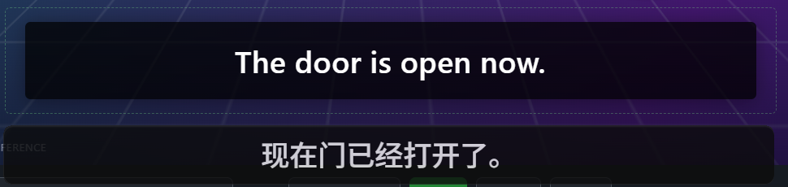

# Inference recovery validation — 2026-09-15

Tested source: `90d4f416f38e08f4c14bb8998371ec426d00a359`.
Windows 11 ARM64, build 26200, display scale 125%; Adreno X1-85,
driver 31.0.148.0. The Tauri development application used an isolated profile
and model cache, English OCR to Simplified Chinese, a 250 ms capture interval,
subtitle-only mode, and no translation context.

The app used its real Windows capture, OCR, HY-MT, and native overlay path.
The [offline fixture](../../evals/band-gate/README.md) ran at 1x with Repeat off.
GPU inference used the existing policy: `-ngl 99 --no-kv-offload`, eight threads,
one inference slot. No GPU or memory gate was overridden.

## Results

| Scenario | Observed result |
| --- | --- |
| Equal-width fixture, 120 seconds, after native region reselection | 30/30 cues recognized, admitted, and translated; gate and end-to-end reports passed without partial evidence; total translation latency p95 777.3 ms |
| Negative-band recovery, 120 seconds | All five recovery cues translated; timer and credits had zero post-warmup admissions; watermark had ten post-warmup admitted frames, so the negative gate failed |
| One controlled termination of the owned GPU engine | Recovery states appeared; exactly one replacement engine started; first successful translation returned 11,710 ms after termination; twelve translations succeeded after termination before stopping capture |
| Real CPU protocol checks | Six translations ended normally; translation continued after an intentionally expired request; quality review, duplicate-report handling, and Core shutdown succeeded |

The first equal-width run produced thirty translations but captured its first
cue before the fixture clock started. Its report correctly accepted only 29/30.
The complete rerun above started the fixture before capture and passed.

The negative run lost OCR for three frames at 36.474–36.995 seconds. At
37.499 seconds the unchanged watermark became cue 2 and was admitted again.
The band-filter and cue-tracker sources are identical to the PR base; this is
an additional observed limitation, outside the inference-recovery change.
Zero timer/credits admissions and five successful dialogue recoveries do not
turn that run into a passing negative gate.

No natural GPU numerical corruption occurred during these runs. They therefore
do not prove recovery from an actual Adreno numerical fault or prevention of
the #215 bugcheck. Controlled Core tests cover health-green corrupt output,
bounded sampling, CPU fallback, duplicate reports, and recovery timeout.
Physical x64, long real-media playback, and packaged release validation remain
outside this evidence. Shipping requires a new Core release and consumer pins.

## Automated checks and artifact identity

`scripts/verify.ps1 -CoreSourceCandidate` passed. Final application edits also
passed fresh clippy with warnings denied and all 499 application unit tests.
The full gate included 81 Core unit tests, 14 Core service contracts, 16 app IPC
tests, two command contracts, 421 frontend tests, and five browser tests.
Dependency audit reported no vulnerabilities.

SHA-256 of the native test binaries:

- Application: `6ab36dd14cad5346e11881ac6d8546e2b5e6f772d7b0c38a2451cfec3929f82e`
- Core: `0ba953a13929f5b8d650a8dac6f03e50afcc06a5f51e15db5f91e9be5239bddd`

Content-aware gate frames, fixture clocks, translation events, and generated
reports remain local. Only the authored fixture image and aggregate findings
are published here.
