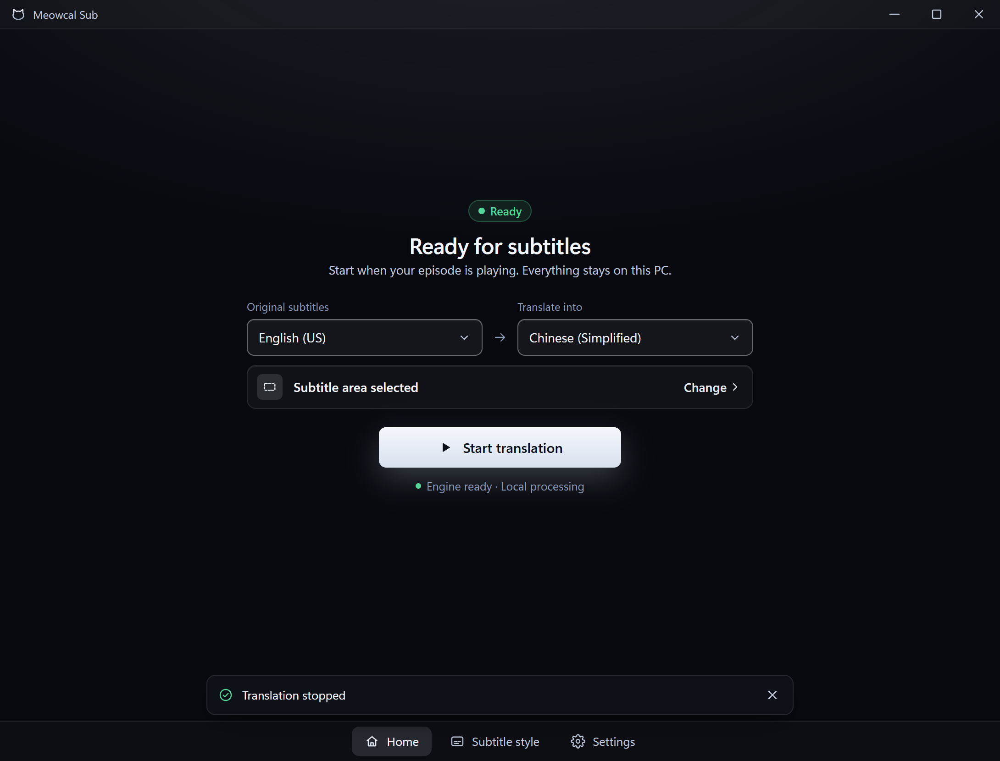

# OCR selection engine preparation

## Tested build

- Runtime commit: `058ea4fb9d5e716bee44a1931ea3425188c45095`.
- Windows 11 build 26200, ARM64; isolated development profile, CPU only.
- App SHA-256: `25375a775224ffaa1398b2ead58e940393c4b2a167990c78833bbd1a98b9da10`.
- Pinned Core 0.1.4 SHA-256:
  `523742d5178bb382d12bae2b9630496fa803bab3a18403f31c77e19e33ba05b9`.
- A separate copy of the installed HY-MT model/runtime was used. Production and
  ordinary development settings hashes were unchanged. No other app/model was
  running during the checks; all test processes and the debug endpoint exited.

## Native result

The native WebView controller received the selector's `set_capture_region` and
`region-selected` contract, then Start was invoked while preparation was pending.
The bridge was instrumented without replacing command responses. This checks the
native event, controller and real Core boundary, not the mouse-drag gesture.

| Observation | Result |
| --- | --- |
| Preparation starts before Start | 5.0 ms earlier |
| `make_engine_ready` calls | Exactly one |
| Start while preparation is pending | Waited, then refreshed readiness and started successfully |
| Preparation duration | 2,918.5 ms in this sample |
| Start command after preparation | 120.5 ms |
| Real Core sample | `Good morning.` → `早上好。`, reported inference 115 ms |

These are ordering and single-preparation observations, not a before/after speed
comparison or physical subtitle latency measurement. Capture used a blank fixture;
the real translation sample was requested separately after stopping capture.

The image is a render captured from the native WebView, not a desktop photograph.
Desktop copying produced a black frame and is not accepted as physical visibility
evidence. An initial harness attempt emitted selection before UI listener setup;
the accepted run waits for initialization. No application permissions were changed.

## Automated result

`scripts/verify.ps1` All passed on the runtime commit: 551 app unit tests, 16 IPC
tests, two command contracts, 534 frontend tests, 27 browser tests, Core checks,
format/lint/types/build/coverage and dependency audit. Focused cases cover selection
events and polling, restored/cancelled areas, repeated selections, immediate Start,
failure/retry, stale completion, execution-policy refresh and ineligible states.
