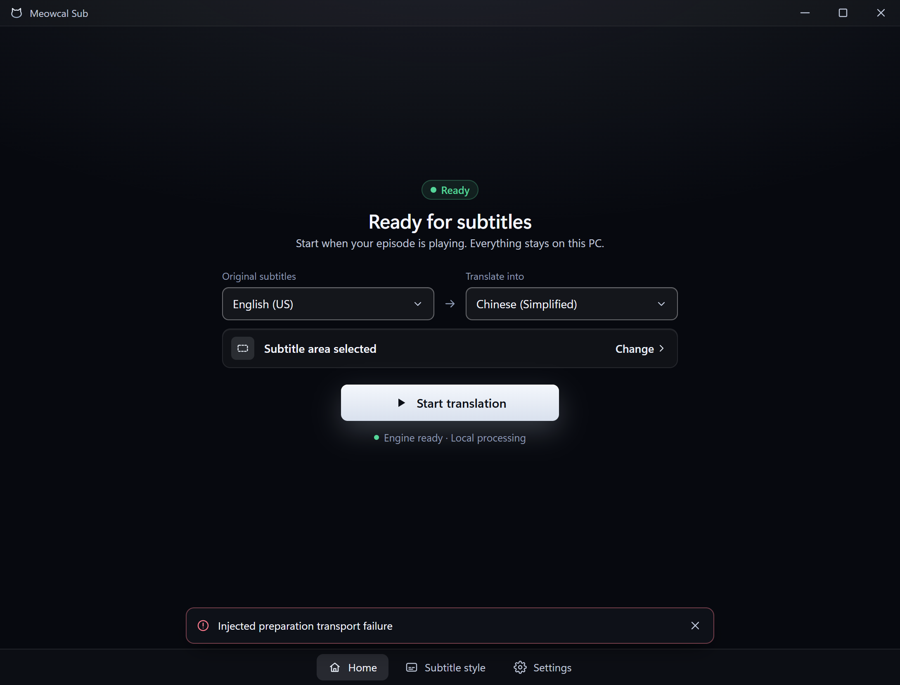

# OCR selection engine preparation

## Tested build

- Runtime commit: `164f27e389e27318aae2536acb7a8d9ac9c7c499`.
- Windows 11 build 26200, ARM64; isolated development profile, CPU only.
- App SHA-256: `c8e31fd306eedff33974967908309ced6d02ff93564bf7befcd223f67df549ff`.
- Pinned Core 0.1.4 SHA-256:
  `523742d5178bb382d12bae2b9630496fa803bab3a18403f31c77e19e33ba05b9`.
- A separate copy of the installed HY-MT model/runtime was used. Production and
  ordinary development settings hashes were unchanged. No other app/model was
  running during the checks; all test processes and the debug endpoint exited.

## Native result

The native WebView controller received the selector's `set_capture_region` and
`region-selected` contract, then a focus event exercised the main window refresh
before clicking Start while preparation was pending.
The bridge was instrumented without replacing command responses. This checks the
native event, controller and real Core boundary, not the mouse-drag gesture.

| Observation | Result |
| --- | --- |
| Preparation starts before Start | 310.0 ms earlier |
| `make_engine_ready` calls | Exactly one |
| Start while preparation is pending | Waited, then refreshed readiness and started successfully |
| Preparation duration | 4,081.6 ms in this sample |
| Start command after preparation | 144.1 ms |
| Real Core sample | `Good morning.` → `早上好。`, reported inference 135 ms |

These are ordering and single-preparation observations, not a before/after speed
comparison or physical subtitle latency measurement. Capture used a blank fixture;
the real translation sample was requested separately after stopping capture.

The image is a render captured from the native WebView, not a desktop photograph.
Desktop copying produced a black frame and is not accepted as physical visibility
evidence. An initial harness attempt emitted selection before UI listener setup;
the accepted run waits for initialization. No application permissions were changed.

## Failed speculative preparation

A separate native session injected one rejected preparation bridge call. Home
showed the error while retaining an enabled Start button and the stopped engine
state, including after focus refresh. Clicking Start invoked the real Core,
reached a running session and translated the same sample (reported inference
122 ms). The injected failure tests UI recovery, not a real engine failure.

## Automated result

`scripts/verify.ps1` All passed on the runtime commit: 551 app unit tests, 16 IPC
tests, two command contracts, 536 frontend tests, 27 browser tests, Core checks,
format/lint/types/build/coverage and dependency audit. Focused cases cover selection
events and polling, restored/cancelled areas, repeated selections, immediate Start,
failure/retry, stale completion, execution-policy refresh and ineligible states.

The Home-route regressions failed before their respective fixes: focus refresh
disabled Start, and a failed warmup replaced Start with Repair. Both now pass.
