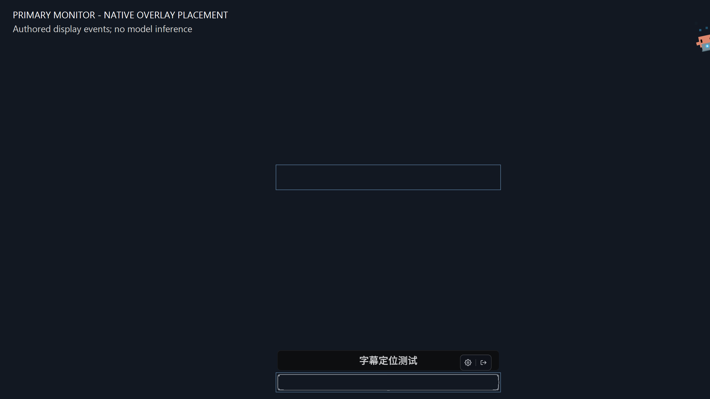

# Primary-monitor overlay validation

Runtime commit: `1db699897d12a093b4e11548cd403d422e71acfb`.

## Failure

Capture and selection use the primary monitor, but the overlay covered the
virtual desktop. With a monitor left of the primary, primary-relative subtitle
coordinates were drawn on that left monitor. The reported installation logged
a virtual origin of `(-3120, 0)` while capture used the primary at `(0, 0)`.

The regression assertion failed with the previous virtual-screen bounds and
passed with primary-screen bounds. The final test independently reads the primary
monitor rectangle through the Windows monitor API.

## Windows evidence

Windows 11 ARM64, build 26200; primary external display 2560×1440 at 125% DPI;
internal display at (-3120, 0), 3120×2080. An isolated debug build used the pinned
Core and a separate configuration. Three native Start/Stop sessions passed:

| Case | Selected logical rectangle | Subtitle logical position |
| --- | --- | --- |
| Below selection | (800, 480), 640×64 | (800, 554), width 640 |
| Near bottom edge | (800, 1080), 640×48 | (800, 1011), width 640 |
| Restart | (800, 480), 640×64 | (800, 554), width 640 |

In every session, the real overlay window stayed at physical (0, 0), 2560×1440,
with scale 1.25 and a 2048×1152 CSS viewport. The screenshot confirms visible
subtitle placement above the bottom-edge selection.

Display events carried authored test text over a blank capture fixture. This
checks native placement, clipping, and restart behavior, not model inference
or capture-to-translation latency. No additional inference process was started.
The test app and fixture exited; production and ordinary development config
hashes remained unchanged.

## Automated checks

`scripts/verify.ps1` All passed: 552 application unit tests, 16 IPC tests,
2 command-contract tests, 517 frontend tests, 27 browser tests, Core checks,
formatting, lint, type checks, maintainability, and dependency audit.
