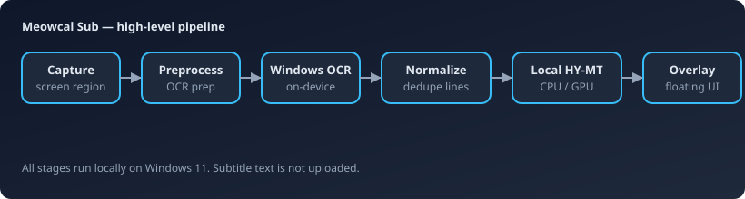

{{LOGO_BLOCK}}<h1 align="center">{{PRODUCT_NAME}}</h1>

<p align="center">
  <strong>{{TAGLINE}}</strong>
</p>

<p align="center">
{{BADGES_ROW}}
</p>

{{HERO_BLOCK}}<p align="center">
  <a href="{{DOWNLOAD_URL}}"><strong>Download</strong></a>
  &nbsp;·&nbsp;
  <a href="{{RELEASES_URL}}">All releases</a>
  &nbsp;·&nbsp;
  <a href="{{RELEASE_NOTES_URL}}">Release notes</a>
</p>

---

## ✨ What it does

Select the on-screen subtitle region once. Meowcal Sub captures that band, runs Windows OCR, translates locally, and draws translated lines in a floating overlay while you watch.

```text
subtitle region → capture → OCR → local translation → overlay
```

No account. Subtitle text is not uploaded. A one-time download (~1.1 GB) sets up the local translation runtime.

## 🎯 Key features

{{FEATURES_TABLE}}

## ⚡ Engineering

{{ENGINEERING_LIST}}

## 📊 Performance

{{BENCHMARKS_SECTION}}

## 🧠 Architecture



| Layer | Role |
| --- | --- |
| Desktop shell | Tauri 2 — window lifecycle, tray, multi-webview UI |
| Capture & OCR | Windows screen capture + WinRT OCR |
| Translation | App-managed local HY-MT runtime with install/repair/rollback |
| Presentation | Selector, setup wizard, and always-on-top overlay webviews |
| Distribution | Dual-arch installers, signature-verified in-app updates |

## 🔒 Privacy

**On your machine:** {{PRIVACY_LOCAL}}

**Uses the network for:** {{PRIVACY_NETWORK}}

**Never sent:** {{PRIVACY_NOT_SENT}}

Production logs record support codes, timings, and counts — not captured or translated subtitle text.

## 📦 Installation

| | |
| --- | --- |
| OS | {{REQUIREMENTS_OS}} |
| x64 | Intel / AMD Windows PCs |
| ARM64 | Snapdragon and other ARM Windows PCs |
| Disk | {{REQUIREMENTS_DISK}} |

{{REQUIREMENTS_NOTES}}

Each release includes NSIS (`.exe`) and MSI installers for both architectures, plus `SHA256SUMS.txt` and `latest.json` for the in-app updater.

Installed copies can update from **Settings → Updates → Check for updates** (manual check only).

## Status

**{{STATUS}}** — actively developed in a private repository. This public repo distributes installers and showcase material only; issues are not accepted here.

Current release: **v{{VERSION}}**

## License

{{LICENSE_SUMMARY}}

---

<p align="center"><sub>{{PRODUCT_NAME}} · v{{VERSION}} · {{STATUS}}</sub></p>
